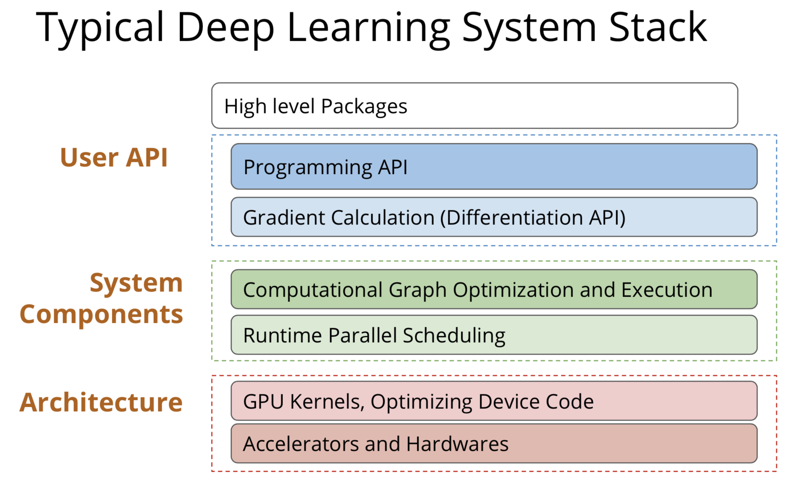

# Deep Learning System

This project describes how to build a simple in-depth learning framework. It comes from a course taught by [**Tianqi Chen**](http://homes.cs.washington.edu/~tqchen/) at Washington University: [**dlsys course**](http://dlsys.cs.washington.edu/). Specifically, it includes the following two tasks:
- **assignment1**:How to realize the basic automatic derivation...

- **assignment2**:Talk about lower level technology, such as GPU..

I have implemented it according to my own understanding.

---

---

The figure above describes the basic composition of a deep learning framework. Let's go!

